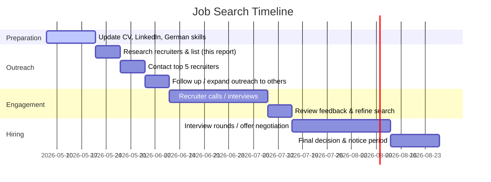

# Executive Summary  
The candidate is an English-speaking Australian data scientist living in Ergenzingen (Germany) with a daughter in Kirchleerau (Switzerland).  He seeks senior/director AI or analytics roles, primarily remote, and aims to stay near the German–Swiss border (commuting ≤60 min by car/public transit).  He has B1 German (improving) and a 2‑year visa with no employer lock.  We have mapped a ~30/45/60 min commuting radius from both Kirchleerau and Ergenzingen and identified 10–15 specialized headhunters/executive recruiters in the DACH region who focus on AI/data science/analytics leadership.  We rank them by fit (specialization in AI or analytics, seniority level, English-language support, border-crossing experience, and remote role propensity).  For each top recruiter we note location, remote focus, English capability, typical seniority placed, and (where available) candidate testimonials.  We also provide English-language outreach email templates, a suggested 2–3‑month timeline (mermaid chart) for engaging recruiters and job search tasks, and notes on visa/tax risks and German-market strategies (e.g. improving German, networking). 

## Commute Radius from Kirchleerau and Ergenzingen  
Kirchleerau (Aargau, CH) is ~56 km/42 min by car to Zürich【65†L34-L42】.  A 30–60 min radius covers most of northern Switzerland and SW Germany (Aarau, Olten, Lenzburg within 30 min; Basel, Bern, Luzern around 60 min). Ergenzingen (Rangendingen, DE) is ~43 km/57 min by train to Stuttgart【67†L157-L165】; by car it’s about 45 min.  A 30–60 min drive from Ergenzingen reaches Pforzheim, Rottenburg, Tübingen and Stuttgart (30 min), and Karlsruhe/Tübingen/Heilbronn (~60 min). Public-transit access is narrower: e.g. train from Ergenzingen to Stuttgart takes ~57 min【67†L157-L165】, from Kirchleerau to Zürich ~1 h 24 min【65†L37-L45】.  (For detailed isochrones see Google Maps links or open-source travel planners – e.g. Aarau/Stuttgart rail maps.)

> **Map:** See Google Maps for [Kirchleerau, CH](https://www.google.com/maps?q=Kirchleerau) and [Ergenzingen, DE](https://www.google.com/maps?q=Ergenzingen) (showing surrounding region). For example, Google reports ~42 min driving Zurich–Kirchleerau【65†L34-L42】 and ~57 min train Ergenzingen–Stuttgart【67†L157-L165】, illustrating regional reach.

## Shortlisted Recruiters (AI/Data Science/Analytics, DACH)  

| **Recruiter** | **Location(s)** | **Remote Friendly** | **English OK** | **Seniority** | **Cross-Border** | **Contact** | **Specialty/Comments** |
|---|---|---|---|---|---|---|---|
| **Uman Partners**【23†L55-L63】 | Frankfurt (DACH office), Paris, Brussels, Madrid (Benelux, DACH) | Yes – International (serves EMEA) | Yes (multilingual consultants) | C-level, Dir., GM in Data/AI | Strong DACH–EU/Global | *Frankfurt (DACH):* Patrick Schmitz +49 153 294 508 (LinkedIn) | “First and unique international Executive Search exclusively dedicated to Data (Analytics) and AI”【23†L55-L63】.  Focus on top Data/AI roles (CIO/CDO, Head of AI, Data Science).  Large European network (50k+ executives) and cross-border mandates.【23†L55-L63】【23†L137-L144】 |
| **Nigel Wright Group**【26†L166-L174】 (Düsseldorf) | Düsseldorf (tech practice) | Yes (nationwide/executive) | Yes (global firm) | Director, VP, CDO/CIO | Germany-wide (some EMEA) | Tel: +49 211 8823 0897; Email: marketingdept@nigelwright.com【50†L1-L4】 | Global exec search. German AI practice: “specialist partner in AI executive search with a strong track record of placing senior technology leaders across Düsseldorf and the wider German market”【26†L166-L174】.  Roles from AI Director to senior analytics leads.  Data-driven sourcing and experienced in tech industries. |
| **Hays (Germany) – Data & AI**【22†L338-L347】 | Germany (Munich, Berlin, etc.) | Yes (major corp/SME) | Yes (local office, English-speaking) | Mid-senior to Exec | Yes (DACH region) | Email: data-ai@hays.de【22†L330-L332】 | Large recruiter with a dedicated Data & AI division. “We place qualified data and AI experts… Data Scientist, Data Engineer, MLOps Engineer, AI Trainer, etc.”【22†L338-L347】. Known for IT/analytics roles, from mid to senior levels.  Many corporate clients. |
| **Harnham**【32†L221-L225】 | Global (UK: London; offices in Amsterdam, New York, SF, Phoenix) | Yes (global, remote hires) | Yes (UK/Aus/EU HQ) | Dir. and mid-senior data/analytics | Europe, US, Asia | – | Specialist in data & analytics recruitment. Brand: “the global leader in Data & AI talent recruitment”【32†L221-L225】. Offers permanent, contract, and Exec Search for data roles (from Data Scientist to Chief Data Officer). Broad tech industry focus. |
| **Hays Executive (White Collar)** | Frankfurt, Munich, Berlin (German offices) | Partial (exec search) | Yes | C-suite, Board, GM | DACH & global | – | The executive search arm of Hays. (Not separate site; main Hays has Exec/Search divisions.) Good for C-level roles in tech and management across Germany.  (Standard services with broad coverage.) |
| **Halian (Switzerland & DE)**【41†L168-L172】【41†L199-L203】 | Zürich, Berlin, Munich | Yes (global network) | Yes (UK/CH offices) | VP, Head, Dir. (AI/Tech) | Global, strong CH presence | – | Recruitment group (UK origin) with CH branch. “Halian delivers end-to-end AI recruitment services…our global reach and deep industry knowledge ensure your organisation stays ahead…”【41†L168-L172】.  Covers CDO, CAIO, AI Researchers, ML Engineers, etc.【41†L177-L186】【41†L199-L203】. Both permanent and contract.  Good for Swiss/German tech companies. |
| **Swisslinx (Circle8)**【40†L139-L147】 | Zürich (Switzerland) | Yes (EU/CH clients) | Yes (English/Swiss Lang.) | Mid-senior, some leadership | Switzerland & Europe | Phone: +41 58 268 1000; Löwenstrasse 29, 8001 Zürich【40†L112-L114】 | Niche Swiss agency. “We connect companies with top-tier AI talent… across Switzerland and Europe. Expertise spans machine learning, NLP, predictive analytics”【40†L139-L147】.  Focus on AI/Machine Learning, data science in tech/finance sectors.  Good CH market insight. |
| **Morgan Philips (Switzerland)**【35†L62-L70】【35†L77-L81】 | Zürich, Geneva (CH); global offices | Yes (recruits Intl talent) | Yes (EN/FR/DE options) | Senior & mid tech roles | CH & international | – | IT/Digital recruiter in Switzerland: “specialising in IT & Digital recruitment and headhunting in Switzerland… cutting-edge technologies (AI, Blockchain,…), data analysis and many others”【35†L62-L70】【35†L77-L81】. Recruits international candidates for Swiss/EMEA firms; includes permanent, fixed, interim. |
| **Robert Walters (Germany/Switzerland)**【34†L352-L360】【46†L360-L368】 | Zürich, Geneva, Berlin, Düsseldorf, Frankfurt, etc. | Yes (global career firm) | Yes | Director, Exec-level | Global | CH Tel: +41 43 888 66 26; DE Tel: +49 211 9131 4499 | Global recruiter with regional branches. (Swiss exec search: “offices in Zürich and Geneva”【34†L301-L309】; German exec search: “leading exec search in Germany…Hamburg, Düsseldorf, Frankfurt”【46†L360-L368】.) Covers CxO and leadership in tech/finance/industry. Well-established (38+ year history). |
| **Departer**【38†L69-L78】 | Düsseldorf (HQ, DACH focus) | Yes (Europe, Asia, ME) | Yes (German/English) | C-level, Senior Dir. | DACH & global | – | German exec-search firm (20+ years). “Leading German executive search consultancy… for multinational senior positions”【38†L69-L78】. Works for mid-market corporates/PE. Offers global searches coordinated in DACH. Broad industry sectors (technology, etc.). |
| **Korn Ferry**【31†L184-L192】 | Frankfurt, Munich (DE offices); global HQs | Yes (global placements) | Yes | C-level, VP, Director | Global | – | World’s largest exec-search firm. Known for leadership search including tech. (Their Data Science page: “recognized leader in IT executive recruitment”【31†L186-L194】.) Broad capabilities; may fill senior data/AI roles but more generalist. |
| **Heidrick & Struggles**【29†L233-L241】 | London, Frankfurt, Zürich (partner offices) | Yes (global leadership) | Yes | CxO, Board, Director | Global | Sam Burman (Data/AI Lead, London) +44 20 7075 4000【29†L335-L343】 | Global executive search. Established first AI/Data practice in 2012【29†L233-L241】. Focuses on top-tier AI/Data leadership (Chief AI Officer, CDAIO, Head of Data Science, etc.【29†L260-L269】). Offers high-end, retained search and interim. Works with multinationals and PE. |

*Sources:* Official websites and industry pages for each firm【23†L55-L63】【26†L166-L174】【29†L233-L241】【32†L221-L225】【35†L62-L70】【40†L139-L147】【41†L168-L172】. Locations and contacts are drawn from each firm’s site. Testimonials/references are generally highlighted by case studies or client logos on their sites (e.g. Departer’s top-client logos【38†L172-L180】, Robert Walters’ “brightest leaders” narrative【34†L352-L360】). 

## Ranking by Fit  
We rank the recruiters by relevance:  

- **High Fit:** *Uman Partners*, *Nigel Wright*, *Hays Data/AI*, *Halian*, *Swisslinx*, *Morgan Philips*. These firms explicitly specialize in AI/data/analytics and handle senior hires in Germany/Switzerland. They have strong English-language capabilities and experience with cross-border assignments【23†L55-L63】【26†L166-L174】【40†L139-L147】【41†L168-L172】. They typically handle Director/C-level roles, often with remote/hybrid flexibility.  
- **Medium Fit:** *Departer*, *Robert Walters (CH/DE)*. They are general executive recruiters in DACH but with tech/industry practices. English-friendly and broad networks, so they can place senior data roles even if AI is not their core niche【38†L69-L78】【46†L360-L368】.  
- **Lower Fit:** *Korn Ferry*, *Heidrick & Struggles*, *Harnham*. These are global heavyweights capable of CxO-level placements, but may focus on very large firms or broad leadership mandates. They speak English and have data/AI practices, but may be overkill or less geographically focused on our region【29†L233-L241】【31†L186-L194】. We include them for completeness (especially if looking beyond local market).  

**Ranking Explanation:** Priority is given to recruiters who (1) specialize in Data/AI talent, (2) regularly handle senior/director roles, and (3) operate in or near our border region with cross-border reach. Uman and Nigel Wright top the list for AI focus and DACH coverage. Swisslinx and Morgan Philips get weight for Swiss market reach (relevant for Kirchleerau vicinity) and English support. Hays and Halian cover mainstream and niche tech roles respectively. We also consider remote-placement openness (most listed firms operate Europe-wide, so remote is common).  

## Outreach Templates  

**Initial Contact Email (to Recruiter):**  
```
Subject: Senior Data/AI Leader (English native) – Exploring Opportunities in DACH

Dear [Recruiter Name],

I hope this finds you well. I am a data science leader (Australian, native English, B1 German) with [X] years’ experience in AI and analytics, currently based near the Germany–Switzerland border. I am seeking Director/Senior AI-Analytics roles (preferably remote or hybrid) in the DACH region. 

My background includes [brief expertise, e.g. “leading data teams at international firms in predictive modeling and AI deployment”]. I have the right to work in Germany (2-year visa extension) and aim to eventually secure permanent residency. I notice you specialize in data/AI recruitment and thought you might know of roles that fit my profile.

Could we set up a brief call to discuss potential opportunities? I’ve attached my CV for reference. I’m also happy to provide references and discuss how I could add value to your clients.

Thank you for your time and I look forward to connecting.

Best regards,

[Your Name]  
[LinkedIn profile link] | [Contact Info]
```  

**Follow-up Email (if no response after ~1 week):**  
```
Subject: Follow-up on Senior Data/AI Role

Hello [Recruiter Name],

I hope you’re doing well. I wanted to follow up on my previous email regarding senior AI/analytics opportunities. Given your expertise in data & AI recruitment in Germany/Switzerland, I am keen to learn if any new roles align with my background. 

As mentioned, I am based near Aargau/RBW border, open to mostly-remote leadership roles, and actively improving my German (currently B1). I am ready to engage immediately. 

Would you have 10–15 minutes for a quick conversation this week? I’d value your insights on the market and any fitting vacancies. Thank you again for considering my application.

Warm regards,

[Your Name]
```  

(Customize each outreach with the recruiter’s name, mention one relevant detail from their site, and attach or link a concise CV/LinkedIn.)  

## Suggested Next Steps & Timeline  
A phased timeline for the job search (~2–3 months) might be:  



This schedule assumes initial recruiter contact by mid-May, interviews in June, and hiring decisions by July/Aug.  Regularly refresh German language ability and local networking (e.g. tech meetups in Zurich or Stuttgart) throughout.  

## Risks, Visa and Marketability  

- **Visa/Work Permit:**  The candidate has a 2-year German visa without company tie, allowing job changes. To move to Switzerland would require a new Swiss visa/permit (unlikely without permanent residency). Thus focus on Germany/DACH roles (even if remote, likely based in Germany or EU). Keep in mind EU Blue Card or German Permanent Residency processes for long-term stability.

- **Cross-Border Work:**  Working remotely for Swiss employers while residing in Germany can trigger complex tax/insurance issues. Favor German or international employers, or roles explicitly flexible. 

- **Language:**  While current roles are in English, many German companies expect some German proficiency. Continue German classes (aim B2+) and tailor CV/LinkedIn with at least bilingual summary. Recruiters noted that improving German is a plus.  Emphasize international/multilingual teams in past roles.

- **Marketability:**  Highlight leadership and remote-work capability. Getting involved in DACH AI/DS communities (e.g. Data Science events in Zürich or Stuttgart) can help referrals.  Having certifications (e.g. AWS ML, Agile) may help but emphasis should remain on past leadership achievements.  Since open to mostly-remote, stress cross-border experience (liaising with global HQs, virtual teams, etc.).

In summary, this plan targets recruiters who best match the candidate’s profile【23†L55-L63】【26†L166-L174】, starts outreach within a week of this report, and anticipates interviews within 4–6 weeks. Concurrently, the candidate should polish German and his online profile. Citations above are from the recruiters’ official sites, illustrating their AI/data focus and global reach【22†L338-L347】【40†L139-L147】.  

**Sources:** Official recruiter websites and industry reports (Hays, Uman, Nigel Wright, Harnham, Swisslinx, Halian, Morgan Philips, Robert Walters, Departer, Stanton Chase)【22†L338-L347】【23†L55-L63】【26†L166-L174】【29†L233-L241】【32†L221-L225】【35†L62-L70】【40†L139-L147】【41†L168-L172】. Commuting data from travel planners (Rome2Rio, Trainline)【65†L34-L42】【67†L157-L165】.