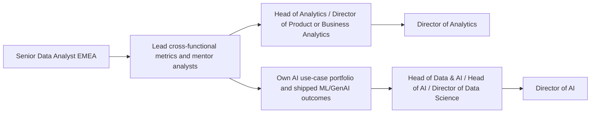
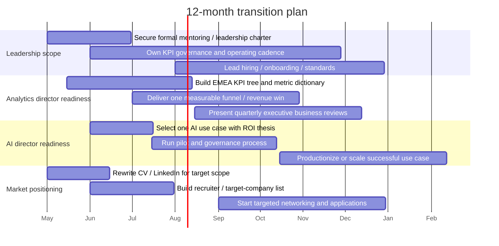

# Path from Senior Data Analyst EMEA to Director of Analytics or Director of AI

## Executive Summary

From the current market, the most realistic near-term jump from a Senior Data Analyst EMEA title is **not** straight into a heavyweight global “Director of AI” seat at a large platform company. The more attainable first destination is usually a **Head of Analytics / Director of Product or Business Analytics** role in a scale-up or mid-sized tech company, or a **Head of Data & Analytics** role in a German SaaS company with strong remote flexibility. Exact “Director of AI” titles in Germany exist, but many employers instead hire into adjacent labels such as Head of AI, Head of Data & AI, Head of Platform AI Innovation, or Director of Data Science / Deep Learning & AI. The title market is fragmented, but the scope is consistent: org design, roadmap ownership, executive influence, and measurable commercial impact. citeturn13view0turn16view1turn18view0turn18view1turn16view2

Compensation is also bifurcated. German salary portals show a relatively conservative cash market for Head-of-Analytics-type roles, while international tech employers in Germany often layer in stock, bonus, or share plans. In practice, a strong Germany-based candidate targeting Director-of-Analytics-equivalent scope should expect a **cash-first market around the high five figures to low six figures**, with better-funded product-tech companies moving meaningfully above that; AI leadership can price higher, especially when the role is close to productized ML, deep learning, or platform strategy. StepStone’s 2026 Germany data and Berlin-specific Glassdoor estimates support that split, while Levels.fyi shows that German tech leadership packages can rise materially when equity is involved. citeturn42view0turn42view2turn42view4turn35search1turn37search2turn34search3turn34search0turn39view3turn41view0

The biggest likely gaps from your current title are not raw analytics skill alone. They are **formal people leadership**, **executive operating cadence**, **ownership of KPI systems across functions**, **budget/resource prioritization**, and, for AI-track roles, **evidence that you can move from analysis to productionized ML/GenAI outcomes**. Current ads repeatedly ask for 8–10+ years overall experience, 2–5+ years of leadership, strong commercial/product judgment, and the ability to influence VP/C-level stakeholders. AI ads add shipping AI products, model architecture or platform literacy, governance, and cross-functional change leadership. citeturn13view0turn29view0turn5view0turn16view0turn7view0turn16view1turn18view0turn26view0

The practical recommendation is to run **two tracks in parallel** over the next 12 months. First, become visibly eligible for **Head/Director of Analytics** by owning cross-functional metrics, mentoring or managing analysts, and demonstrating EMEA-wide impact in revenue, retention, margin, or process efficiency. Second, build an **AI leadership portfolio** through one or two production-facing AI programs, ideally with ROI, governance, rollout, and adoption metrics. That dual-track approach keeps you competitively positioned for remote-first Germany roles while creating optionality for Director-of-AI-equivalent positions later. citeturn16view0turn30view0turn18view1turn16view1turn18view0

## Compensation Benchmarks

The most reliable Germany-wide cash baseline in the sources came from entity["company","StepStone","job platform"]. Its 2026 report says Germany’s overall median salary is €53,900 and that the report is based on more than 1.3 million data points. Its role pages put **Head of Analytics** in Germany at **€74.9k–€97.8k**, with a reported average of **€83.9k**, and its **Head of Data Analytics** jobs page shows **€76.0k–€99.3k** with an average of **€86.2k**. StepStone’s Berlin view for Head of Analytics is **€75.5k–€98.7k**. These are useful as German-market cash anchors, but they likely understate upper-end international tech packages and often reflect broader employer mixes than just venture-backed SaaS or listed tech firms. citeturn42view0turn42view2turn42view4

entity["company","Glassdoor","jobs and salaries"] shows higher Berlin estimates for leadership titles, but with much smaller samples, so it is best treated as directional rather than definitive. As of April 2026, its Berlin pages show **Head of Analytics** at **€131.9k–€165.0k typical pay**, **Head of Data** at **€90.0k–€139.3k**, **Head of Data & Analytics** at **€76.3k–€119.3k**, and **Head of AI** at **€81.7k–€170.3k**. The spread tells you more than the point estimate: title labels are inconsistent, but the market does recognize a premium once the role combines org leadership, product/business scope, and AI ownership. citeturn35search1turn37search2turn37search17turn34search0

For remote-eligible and stock-bearing employers, the best evidence in the gathered sources came from entity["company","Levels.fyi","salary data platform"]. Its Germany-wide **Data Science Manager** market page shows **€109k–€160k** with **€130k median total compensation**. Company pages for entity["company","Zalando","fashion ecommerce"] and entity["company","Deel","hr payroll platform"] put Germany Data Science Manager total comp ranges at **€86.1k–€162k** and **€115k–€168k** respectively, and entity["company","Google","search company"]’s Germany Software Engineering Manager page shows **€160k–€288k** total comp, explicitly separating total compensation from base, stock, and bonus. These are not perfect title matches for Director of Analytics or Director of AI, but they are highly relevant as **Germany-based leadership-package proxies for remote/global tech firms**. citeturn39view3turn39view1turn39view0turn41view0

A practical salary synthesis for a Germany-based candidate targeting your next step is below. These bands are **inferences from the sources above**, not direct quotes from a single survey, and they reflect the reality that “Director,” “Head,” and “Senior Manager” are used inconsistently across employers. citeturn42view2turn42view4turn35search1turn34search0turn39view3turn41view0

| Market band | What it usually maps to | Practical target range | What to assume about comp mix | Evidence |
|---|---|---:|---|---|
| Stepping-stone leadership | Lead Analytics / Manager Analytics / senior manager-equivalent | **€58k–€80k cash** | Mostly base; occasional bonus / 13th-month style extras | citeturn36search6turn36search9 |
| Germany cash-market analytics leadership | Head of Analytics / Head of Data Analytics in local or mid-market firms | **€75k–€100k cash** | Mostly base; bonus sometimes negotiable | citeturn42view2turn42view4 |
| Berlin / scale-up / product-tech analytics leadership | Head / Director-equivalent in product, growth, or commercial analytics | **€110k–€165k total pay** | Base-heavy, but better-funded employers can add bonus/equity | citeturn35search1turn37search2turn37search17 |
| Germany AI leadership | Head of AI / Head of Data & AI / Director-level AI-adjacent roles | **€120k–€180k total pay** | Wider variance; pay rises with shipped AI products and product P&L scope | citeturn34search0turn39view3turn18view0turn16view1 |
| Premium global-tech upper band | Public or global-tech leadership packages in Germany | **€180k–€250k+ total comp** | Stock and bonus become material, sometimes decisive | citeturn41view0turn39view0turn39view1 |

The clearest lesson on **total comp vs. base** is that German salary pages usually show gross salary or salary estimates, while international tech employers often structure leadership pay as **base + bonus + stock/share component**. Current career pages also signal this qualitatively: Delivery Hero’s leadership ads in Berlin highlight an employee share purchase plan and pension benefits, while Levels.fyi explicitly breaks German packages into base, stock, and bonus components. If you move into a Germany-based but internationally benchmarked remote-capable employer, total comp can diverge sharply from cash-only salary pages. citeturn30view0turn39view3turn41view0

## What Current Ads Demand

A strong pattern in current ads is that **Director of Analytics** and **Director of AI** are often represented by adjacent titles. On the analytics side, the market uses Director of Product Analytics, Head of Analytics, Head of Data & Analytics, or Director of BI & Marketing Analytics. On the AI side, it uses Head of AI, Head of Platform AI Innovation, Head of Product – Data & AI, or Director of Data Science – Deep Learning & AI. For your search, restricting yourself to the exact strings “Director of Analytics” and “Director of AI” would leave relevant openings off the table. citeturn13view0turn29view0turn16view0turn16view1turn18view1turn18view0turn26view0

### Sample current Analytics-track listings

| Title | Company | Location / remote | Salary in ad | Typical requirements in ad | Must-have skills | Sources |
|---|---|---|---|---|---|---|
| Director of Product Analytics | entity["company","Pipedrive","crm software"] | entity["city","Berlin","Germany"] hybrid | Not disclosed | 10+ years in analytics; 5+ years leading product analytics or product data science; team-building in high-growth global environment; ideally 10+ people | SQL, Tableau, Amplitude, Optimizely, experimentation, SaaS metrics, churn/predictive modeling, executive communication | citeturn13view0 |
| Director of Analytics, Courier | entity["company","Wolt","food delivery platform"] | Berlin / multi-hub | Not disclosed | Director-level leadership; full ownership of courier domain; lead and grow ~12 analytics and data science professionals; senior decision support | Advanced analytics, product data science, stakeholder influence, org scaling | citeturn33search0turn33search2turn33search7turn33search14 |
| Head of Analytics | entity["company","Forto","logistics tech"] | Berlin or Spain | Not disclosed | 8+ years in analytics/BI/data science; 2+ years leadership; build and scale analytics function; hands-on when needed | SQL, BI tools, modern data stack, metric governance, cross-functional influence | citeturn5view0turn28search6 |
| Head of Data & Analytics | entity["company","Checkmk","it monitoring software"] | Germany remote / entity["city","Munich","Germany"] optional | “Attractive salary” only | 6+ years in data & analytics; 2+ years leadership in SaaS/high-growth; own BI roadmap and Tableau Cloud; lead data engineering talent | Expert SQL, Tableau, Python familiarity, Postgres modeling, SaaS metrics, demand management | citeturn29view0 |
| Head of Analytics | entity["company","TaxDome","accounting software"] | Global remote | Not disclosed | Own analytics strategy and roadmap; translate company OKRs into KPIs; mature governance and self-service; report to VP Product | Product analytics, data engineering, KPI design, analytics maturity, cross-functional leadership | citeturn16view0turn28search10 |

### Sample current AI-track listings

| Title | Company | Location / remote | Salary in ad | Typical requirements in ad | Must-have skills | Sources |
|---|---|---|---|---|---|---|
| Director of AI & GenAI Automation | entity["company","Hypatos","ai automation"] | Berlin or Sofia hybrid | Not disclosed | 7+ years in product, engineering, or strategy leadership in AI/SaaS; drive end-to-end innovation strategy from idea to go-to-market | AI strategy, GenAI productization, cross-functional leadership, technical fluency, GTM thinking | citeturn7view0 |
| Head of AI (SaaS) | entity["company","team.blue","web hosting saas"] | Germany-eligible, fully remote | Not disclosed | 5+ years shipping AI products to real users; matrix influence across brands; roadmap coordination | AI architecture, product innovation, stakeholder management, AI roadmap alignment, executive briefings | citeturn16view1 |
| Head of Platform AI Innovation | entity["company","Jedox","epm software"] | Germany remote | Not disclosed | Lead AI innovation function; align with VP Engineering; budget, capability development, KPI-driven delivery | Platform strategy, AI innovation, budget control, cross-functional coordination, research adoption | citeturn18view1turn17search1 |
| Head of AI – Driving Innovation Across Product & Enterprise | entity["company","Volkswagen AG","automaker"] | entity["city","Wolfsburg","Germany"], remote per policy | Not disclosed | Strong academic background in AI/CS/DS; track record leading AI teams across product and enterprise transformation | Applied AI, mobility/product integration, enterprise AI, international leadership, English C1 / German B2 | citeturn18view0 |
| Head of Product – Data & AI | entity["company","GROPYUS","construction tech"] | Berlin | Not disclosed | Master’s or equivalent; 7+ years product management with major data/AI focus; own vision and lifecycle of data/AI products | Product strategy, data platforms, cloud ecosystems, ML frameworks, governance/compliance collaboration | citeturn16view2 |

### Common requirement pattern by target path

The current ad market is surprisingly consistent on the core thresholds. For **Analytics leadership**, the modal requirement is roughly **8–10+ years overall experience**, with **2–5+ years of formal leadership**, especially in SaaS, digital product, or high-growth environments. The tool stack is usually less exotic than candidates expect: **SQL remains table stakes**, then BI/visualization, experimentation, causal inference or A/B testing, metric design, and strong translation between data and business decisions. Domain experience matters a great deal: product-led growth, growth marketing, revenue operations, logistics, or SaaS finance all show up clearly. citeturn13view0turn29view0turn5view0turn16view0turn30view0

For **AI leadership**, the bar shifts from “good analyst with some ML familiarity” to “leader who has actually shipped AI or built the org/roadmap that ships it.” Current AI ads ask for **5–8+ years of AI, data, product, or technical leadership**, often combined with an advanced academic background or equivalent depth. Shipping experience matters more than title purity: end-user AI products, platform AI innovation, AdTech deep learning, or enterprise AI transformation are the proof points employers reward. AI roles also ask more often for cloud, architecture, MLOps-adjacent literacy, research translation, and budget or capability development. citeturn7view0turn16view1turn18view1turn18view0turn26view0

On **education**, analytics director ads are relatively forgiving; many emphasize track record over degree language. AI leadership ads are less forgiving. Volkswagen explicitly asks for a completed degree in computer science with strong academic grounding in AI/data science, Delivery Hero asks for a master’s or higher, and GROPYUS prefers an advanced degree. That does not mean a master’s is always mandatory; it means the burden of proof on practical AI depth is higher when the degree signal is weaker. citeturn18view0turn26view0turn16view2

On **certifications and publications**, the most important insight is what the ads **do not** emphasize. Across the sampled postings, I did not find formal certifications listed as a central hiring filter; the recurring filters are shipped work, leadership scope, quantitative depth, and domain fit. For AI-track roles, advanced degrees and research-adjacent credibility appear more frequently than named certifications. That suggests a smart strategy: pursue certifications only where they support your target stack or credibility, such as cloud/data platform credentials, and treat publications less as academic papers and more as **evidence of thought leadership**: conference talks, technical blogs, internal AI playbooks, public case studies, or portfolio artifacts. That inference is consistent with the ads’ heavy focus on implementation, architecture, and translating complex work to stakeholders. citeturn18view0turn26view0turn16view1turn18view1turn45view0

## Operating Model and Success Measures

The reporting line pattern is one of the clearest signals about how to position yourself. **Analytics leaders** do not always report into a CDAO. In the sample, they report into strategic finance, product, or adjacent executive data structures depending on whether the company treats analytics as a business-operating function, a product-growth function, or a centralized data function. Forto’s Head of Analytics reports to the Director of Strategic Finance; TaxDome’s Head of Analytics reports to the VP of Product; Pipedrive’s role sits in the CDAO organization; Delivery Hero’s BI & Marketing Analytics role sits inside global marketing and supports C-level choices. That means your positioning should be flexible: you are not just “reporting analytics,” you are enabling strategy, product, and commercial execution. citeturn5view0turn16view0turn13view0turn30view0

Team size in current ads is large enough to matter. Wolt states roughly **12** analytics/data science professionals, Delivery Hero states **20** BI and marketing analysts, and Pipedrive says prior experience scaling teams of **10+** is preferred. Even where ads do not disclose a number, they describe org design decisions, hiring plans, or multi-cluster leadership, which implies manager-of-managers or player-coach leadership. This is one of the sharpest distinctions between a senior analyst and a director-equivalent leader. citeturn33search2turn30view0turn13view0turn16view0

The KPI expectations are also much broader than many candidates realize. For analytics roles, the repeated themes are **ARR growth, activation, retention, churn, CSAT, funnel conversion, marketing ROI, customer lifetime value, LTV/CAC, experimentation outcomes, and metric governance**. In other words, the role is expected to own not just analyses but the **company’s measurement logic**: what counts, how it is defined, where it lives, and how it changes decisions. TaxDome explicitly links analytics priorities to ARR growth, retention, activation, and CSAT; Checkmk owns ARR and funnel-conversion accuracy; Pipedrive and Delivery Hero link analytics directly to LTV/CAC, retention, segmentation, ROI, and experimentation. citeturn16view0turn29view0turn13view0turn30view0

AI leaders are judged on a different but related KPI set: **use-case prioritization, shipped AI capabilities, business value from AI adoption, capability development, budget/cost control, risk visibility, and integration into real products or enterprise processes**. Jedox explicitly calls for KPI-driven delivery and budget control; team.blue emphasizes executive briefings, roadmap alignment, and value creation across brands; Volkswagen focuses on integrating AI into automotive products and operational excellence; Hypatos frames the role around end-to-end AI and GenAI innovation strategy. That means your AI story must include **deployment, governance, organizational adoption, and ROI**, not just model quality. citeturn18view1turn16view1turn18view0turn7view0

A simple map of how employers are really segmenting these paths looks like this. The model is an inference from the current postings. citeturn13view0turn5view0turn16view0turn7view0turn16view1turn18view1

Interview processes for these roles will almost certainly probe the operating model above. Based on the ads, expect deep discussion on **metric design, organizational design, prioritization under resource constraints, experimentation or causal measurement, stakeholder conflict, roadmap trade-offs, data quality/governance, and executive communication**. AI-track interviews will add **model deployment choices, risk/compliance trade-offs, build-versus-buy, platform architecture, and AI use-case economics**. citeturn13view0turn29view0turn30view0turn18view1turn18view0turn16view1

The most likely case-study formats, derived from the live role demands, are:

- **Analytics case**: “Our activation and retention dropped in EMEA/SaaS/product funnel. Build the KPI tree, identify the likely breakpoints, propose an experimentation roadmap, and recommend a resourcing plan.” That mirrors Pipedrive’s measurement and experimentation remit, Delivery Hero’s lifecycle and ROI remit, and Checkmk’s funnel and ARR governance remit. citeturn13view0turn30view0turn29view0
- **Marketing / commercial analytics case**: “Marketing spend rose but management does not trust attribution. Design a framework using incrementality, MMM, and reporting governance.” That is directly aligned with Delivery Hero’s director ad. citeturn30view0
- **AI portfolio case**: “You have budget for only two AI initiatives this year. Which use cases do you prioritize, how do you measure value, and how do you govern rollout?” That reflects team.blue, Jedox, Hypatos, and Volkswagen. citeturn16view1turn18view1turn7view0turn18view0
- **AI productization case**: “Take a promising model or GenAI idea from prototype to production. What architecture, stakeholders, controls, and KPIs do you need?” That matches Delivery Hero’s deep-learning role, GROPYUS’s data/AI product lifecycle, and Hypatos’s end-to-end innovation mandate. citeturn26view0turn16view2turn7view0

## Gap Analysis and How to Close It

Because you only disclosed your current title and region, the fairest assumption is that you are a **senior individual contributor or informal lead with strong regional analytics scope**, but not yet carrying full director-level accountability for people, operating cadence, or AI portfolio ownership. If that assumption is wrong, you should adjust the timeline below upward or downward. Still, against the sampled job ads, the likely gaps are clear. citeturn13view0turn29view0turn16view0turn16view1turn18view1

### The likely gaps

**Leadership-credit gap.** Director-equivalent ads repeatedly ask for team-building, mentoring, hiring, career development, and leading teams of roughly 10–20 people or equivalent multi-team influence. A Senior Data Analyst title rarely signals that by itself. You need visible evidence of formal or quasi-formal leadership, not just “worked with stakeholders.” citeturn13view0turn30view0turn33search2turn16view0

**Operating-system gap.** Target roles own roadmaps, KPI frameworks, governance, prioritization, and maturity models. Senior analysts are often excellent at analysis but under-credited for designing the measurement system itself. You need explicit proof that you can define the metric stack, the cadence, the decision forums, and the ownership model. citeturn16view0turn29view0turn13view0

**Executive-story gap.** The ads care less about “good dashboards” and more about “clear narratives that influence VP/C-level stakeholders.” You need repeated examples of persuading senior leaders, setting direction, and making trade-offs under uncertainty. citeturn13view0turn30view0turn16view1turn18view0

**AI productization gap.** For a Director-of-AI path, analytics excellence is not enough. You need proof that you can move from insight to production: model or GenAI use-case framing, architecture choices, risk and governance, rollout, adoption, and measurable value. citeturn7view0turn16view1turn18view1turn26view0

### Concrete steps to close them

The most efficient move is to build **director-shaped evidence inside your current role**, even before your title changes.

First, own a **cross-functional KPI program**. Build or re-build an EMEA KPI tree that connects top-line commercial outcomes to operational and product-level drivers. Define metric owners, refresh cadence, and a written metric dictionary. The goal is not another dashboard; the goal is to show that you can create the company’s “source of truth.” That is directly aligned with Checkmk’s BI roadmap and governance mandate, TaxDome’s maturity framework, and Pipedrive’s measurement strategy. citeturn29view0turn16view0turn13view0

Second, create at least one **portfolio-level growth story**. A strong Director-of-Analytics-ready project is something like: “Reduced funnel leakage across EMEA by redesigning the metric stack, re-prioritizing interventions, and proving causal lift through experimentation.” A strong Director-of-AI-ready project is something like: “Launched an AI-assisted workflow or forecast engine with clear adoption, quality, and savings metrics.” The key is to move from activity metrics to business metrics. Good evidence includes revenue influence, conversion lift, churn reduction, forecast error reduction, cost takeout, analyst hours saved, or decision cycle-time compression. citeturn30view0turn13view0turn18view1turn7view0

Third, secure **people leadership credit** within the next review cycle. If you cannot get a manager title immediately, ask to own hiring, onboarding, mentoring, review calibration, analytics standards, or a virtual pod. Director ads care about whether you can build capability, not only whether HR has already changed your title. The job postings repeatedly mention mentoring, team development, onboarding, and capability growth. citeturn16view0turn18view1turn30view0turn5view0

Fourth, for the AI track, run one **production-adjacent AI program** with governance. A credible example would be an LLM-enabled analyst workflow, decision support assistant, demand forecast, anomaly detection workflow, or marketing optimization use case with documented guardrails, user adoption targets, and ROI. If you cannot ship models directly, own the business case, use-case prioritization, evaluation criteria, and rollout governance with engineering or data science peers. That is already director-shaped work. citeturn16view1turn18view0turn26view0turn7view0

### Metrics you should be able to put on your CV within a year

For the analytics path, the strongest metrics are typically:
- revenue or gross-margin influenced,
- conversion or activation uplift,
- churn / retention impact,
- KPI adoption across teams,
- time-to-insight reduction,
- analyst productivity improvement,
- data-quality or trust improvements tied to decision-making. citeturn16view0turn29view0turn13view0turn30view0

For the AI path, the strongest metrics are typically:
- deployment velocity from pilot to production,
- model or workflow adoption,
- process hours saved,
- unit-cost reduction,
- incremental revenue or conversion,
- quality/error reduction,
- governance compliance or risk reduction,
- budget efficiency. citeturn18view1turn16view1turn18view0turn26view0

My practical recommendation is this:

- If you can secure formal leadership and KPI ownership quickly, **target Head/Director of Analytics roles in 12 months**.
- If you cannot yet show shipped AI products or AI-portfolio governance, treat **Director of AI as a second-wave move**, more realistically **18–30 months** unless your current role already includes production ML leadership. citeturn13view0turn7view0turn18view0turn26view0

## Positioning Your Search Materials

For Germany-based applications, the safest approach is to maintain **two CV variants**.

One should be an **international English CV** for remote-first or global tech employers: concise, achievement-led, no photo unless specifically requested, strong headline, quantified bullets, and links to portfolio or case studies. The second should be a **Germany-friendly tabular CV** for local employers or more traditional firms. The German government’s “Make it in Germany” guidance says a CV in Germany is typically tabular, anti-chronological, and commonly includes personal data, work experience, education, language skills using CEFR levels, and optionally a photo, though the expectation varies by industry. It also notes that companies may ask for German or English, so you should match the posting language. entity["organization","Make it in Germany","german govt portal"] explains that a full German application often includes a cover letter, tabular CV, and references. citeturn45view2turn45view3

A strong structure for your English remote-first CV is:

1. Name, Germany location, email, phone, LinkedIn, optional portfolio  
2. One-line headline  
3. Executive summary with scope and commercial impact  
4. Selected leadership strengths  
5. Experience in reverse chronology  
6. Selected transformation projects or AI programs  
7. Education  
8. Certifications  
9. Publications / speaking / case studies / OSS, if relevant. citeturn45view2turn43search3turn45view3

A sample headline that fits the target market:

**Senior Data Analyst EMEA | Analytics Strategy, KPI Governance, Product & Commercial Insights | SQL, Python, BI | Germany-based, remote-ready across EMEA**

That headline works because current ads reward scope, business value, and leadership-adjacent capability more than technical keyword stuffing alone. citeturn13view0turn29view0turn16view0

### Bullet examples you should aim to earn and then use

The following bullets are **templates**, not claims about your current experience. They are shaped to match current Germany / remote ads.

- Led the redesign of the EMEA KPI framework across commercial, product, and operations teams, reducing metric ambiguity and improving executive decision speed by **X%**.
- Built a self-service analytics layer used by **X+** stakeholders across **Y** countries, reducing ad hoc reporting requests by **X%** and analyst turnaround time by **Y days**.
- Partnered with product and commercial leadership to identify funnel leakage, prioritize interventions, and deliver **X bps** improvement in activation / conversion.
- Introduced experimentation and causal measurement standards for regional initiatives, improving confidence in investment decisions and lifting measured ROI by **X%**.
- Mentored **X** analysts / analytics engineers, set analytical standards, and created review rhythms that improved output quality and team scalability.
- Owned the analytics narrative for annual planning, translating business objectives into KPI trees, dashboards, and quarterly decision cadences.
- Scoped and launched an AI-enabled workflow for **[forecasting / support / content / pricing / anomaly detection]**, achieving **X hours saved / Y% faster cycle time / Z% accuracy gain**.
- Directed cross-functional rollout of a data or AI initiative across **X** countries / business units, coordinating product, engineering, finance, and operations stakeholders.
- Built governance for core commercial or product metrics, increasing trust in ARR / churn / funnel reporting and reducing reconciliation effort by **X%**.
- Presented recommendations to director or VP-level leadership that influenced investment prioritization, roadmap decisions, or operating model changes totaling **€X** of budget. citeturn16view0turn13view0turn29view0turn30view0turn18view1turn7view0

On your entity["company","LinkedIn","professional network"] profile, the official help guidance is clear: complete profiles improve discoverability; good photos increase credibility and views; strong headlines and summaries matter; relevant skills improve discoverability; media samples can showcase work; #OpenToWork, job alerts, remote filters, recommendations, and direct engagement with companies all help. For your use case, the highest-value optimizations are:
- headline that states target scope, not only current title;
- About section with quantified EMEA impact and leadership trajectory;
- Featured section with 2–3 artifacts such as dashboards, operating models, internal talks, or sanitized case studies;
- skills aligned to the ads: SQL, experimentation, KPI governance, product analytics, growth analytics, AI strategy, data platform, stakeholder management;
- location set to Germany and job preferences including remote / hybrid in Germany and EMEA;
- #OpenToWork restricted to recruiters if you need discretion;
- visible recommendations from senior stakeholders emphasizing leadership, influence, and ownership. citeturn45view0turn45view1turn43search1turn43search20turn43search9

For hiring channels, the most efficient stack is:
- company career pages,
- LinkedIn Jobs with alerts and remote filters,
- StepStone for Germany-specific openings and pay context,
- discreet recruiter outreach for search-led openings,
- selective use of government or major portal listings for broader Germany visibility.  

The German government portal notes that company websites and business networks are central search channels and that having an informative professional-network profile helps you be discovered. LinkedIn’s own guidance adds job alerts, remote-job alerts, following company pages, contacting job posters, and engaging with company content. citeturn45view3turn45view1

## Timeline and Milestones

The best 12-month plan is to treat your transition as a **promotion campaign backed by evidence**, not a passive job search. The timeline below assumes you want to become credibly eligible for Analytics-director-equivalent roles inside 12 months while laying the foundation for AI-director-equivalent roles. The sequencing is based on the gaps implicit in the sampled ads. citeturn13view0turn29view0turn16view0turn7view0turn16view1turn18view1

### Milestones that matter

By the end of **month three**, you should be able to say: “I own a meaningful KPI or operating framework, I mentor people, and I am already doing work above my title.” If you do not have that by quarter-end, the transition timeline likely slips. citeturn29view0turn16view0turn5view0

By the end of **month six**, you should have at least one quantified cross-functional win and one visible executive-facing deliverable. That is the point where you become plausibly competitive for Head-of-Analytics / Director-of-Analytics-screen equivalents. citeturn13view0turn30view0

By the end of **month nine**, you should have an AI artifact that is more than a prototype: live pilot, documented governance, measurable adoption, or a clear production roadmap with stakeholder buy-in. Without that, “Director of AI” interviews are likely to expose a credibility gap. citeturn7view0turn16view1turn18view1

By the end of **month twelve**, your application package should tell one of these stories clearly:

- **Analytics story**: “I already operate like a Head/Director of Analytics; my title is the lagging indicator.”
- **AI story**: “I have already led the business and operating side of AI productization and can scale it.” citeturn13view0turn16view1turn18view0

## Open Questions and Limitations

The main limitation in the market data is that **many current German director-level ads do not disclose salary**, and exact “Director of AI” salary benchmarks in Germany are thin. I therefore triangulated across StepStone salary pages, Glassdoor city-page estimates, and Germany-based total-comp data from Levels.fyi for adjacent leadership roles. That makes the salary bands above useful, but more robust as **decision ranges** than as precise offer predictions. citeturn42view2turn42view4turn34search0turn39view3turn41view0

The second limitation is title normalization. Many openings that are effectively director-scope use **Head**, **Senior Director**, or **Director of Data Science / Product Analytics / Data & AI** rather than the exact target strings you asked for. In practice, you should search by scope and reporting line, not by title only. citeturn13view0turn16view1turn18view1turn16view2

The third limitation is your undisclosed background beyond title and region. If you already manage people, own regional budgets, or have shipped ML systems, you may be closer to the AI path than this report assumes. If not, the recommendation to prioritize Analytics-director readiness first is the safer one.